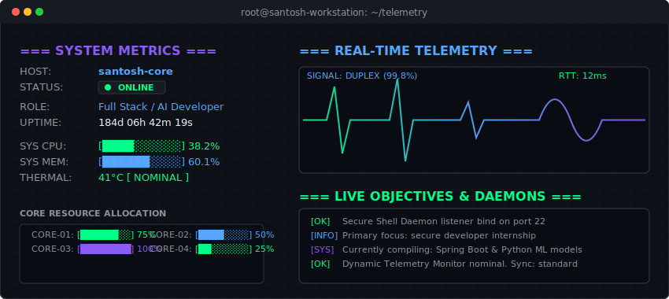

<!-- START TELEMETRY & BOOT WINDOW -->
<p align="center">
  
</p>

<p align="center">
  <a href="https://git.io/typing-svg">
    
  </a>
</p>

<p align="center">
  
</p>

<!-- START SSH SESSION -->
<div align="left">

### `$ ssh recruiter@santosh-core`

```text
Host verification: verified [127.0.0.1]
RSA Key signature: SHA256:4a5B7c...
Authentication Successful.
Loading developer workspace...
```

---

### `$ whoami`

```text
NAME:          sai santosh preetam (santosh)
ROLE:          Full Stack Developer & AI Builder
LOCATION:      India (GMT+5:30)
FOCUS:         Spring Boot | React | Node.js | Network Automation | AI Search
MISSION:       Securing Software Engineer Internships & constructing robust backend platforms.
```

---

### `$ pwd`

```text
/home/santosh
```

---

### `$ cat tech_stack.json`

```json
{
  "languages": {
    "Java": "Robust Backend Core",
    "Python": "Simulation engines & scripts",
    "C_Cpp": "Low-level system fundamentals",
    "JavaScript": "Dynamic client-side features"
  },
  "frameworks_runtimes": {
    "Node.js": "Event-driven REST APIs",
    "Next.js": "React framework for production apps"
  },
  "frontend": {
    "HTML": "Semantic document structures",
    "CSS": "Aesthetics, layout grid, and custom themes"
  },
  "databases": {
    "MySQL": "Relational storage, triggers, and indices"
  },
  "tools_automation": {
    "Git": "Distributed version control",
    "GitHub": "CI/CD Actions & collaboration",
    "n8n": "Advanced workflow logical nodes",
    "Figma_Canva": "Product layouts & user interface designs"
  }
}
```

<p align="left">
  
  
  
  
  
  
  
  
</p>

---

### `$ ls -la projects/`

<details open>
<summary>📂 <b>projects (Click to collapse/expand workspace folders)</b></summary>
<br>
<blockquote>

  <!-- PROJECT 1: Project-Zenith -->
  <details>
    <summary>📂 <b>Project-Zenith/</b> &nbsp;   <code>[ACTIVE]</code></summary>
    <br>
    <ul>
      <li>💡 <b>Overview:</b> A scientifically grounded real-time web platform predicting when, where, and whether the International Space Station (ISS) is visible from any coordinate on Earth.</li>
      <li>🛠️ <b>Tech Stack:</b> JavaScript, SGP4 Orbital Propagation, Cesium 3D Globe API, Live TLE telemetry.</li>
      <li>⚡ <b>Key Features:</b> Real-time 3D orbital path mapping, solar geometry elevation & shadow checks, local meteorological advisories, live altitude/velocity telemetry.</li>
      <li>🔗 <b>Repo:</b> <a href="https://github.com/santosh-1107/Project-Zenith" target="_blank">github.com/santosh-1107/Project-Zenith</a></li>
      <li>🚀 <b>Demo:</b> <a href="https://project-zenith-livid.vercel.app" target="_blank">project-zenith-livid.vercel.app</a></li>
      <li>🚦 <b>Status:</b> Production Ready</li>
    </ul>
  </details>
  <br>

  <!-- PROJECT 2: EventVault -->
  <details>
    <summary>📂 <b>EventVault/</b> &nbsp;    <code>[ACTIVE]</code></summary>
    <br>
    <ul>
      <li>💡 <b>Overview:</b> Concurrency-safe event discovery and ticket booking engine equipped with transactional seat allocation protocols.</li>
      <li>🛠️ <b>Tech Stack:</b> React.js, Vite, Tailwind CSS, Node.js, Express, JWT, MySQL (Railway), MySQL2.</li>
      <li>⚡ <b>Key Features:</b> Dynamic interactive seating grid map, secure JWT user tokens, transactional booking isolation using <code>SELECT ... FOR UPDATE</code> SQL locks, unique composite key constraints.</li>
      <li>🔗 <b>Repo:</b> <a href="https://github.com/santosh-1107/EventVault" target="_blank">github.com/santosh-1107/EventVault</a></li>
      <li>🚦 <b>Status:</b> Production Ready</li>
    </ul>
  </details>
  <br>

  <!-- PROJECT 3: Foodfrenzy -->
  <details>
    <summary>📂 <b>Foodfrenzy/</b> &nbsp;    <code>[ACTIVE]</code></summary>
    <br>
    <ul>
      <li>💡 <b>Overview:</b> Comprehensive enterprise operations portal for managing customer registries, warehouse stocks, and processing orders.</li>
      <li>🛠️ <b>Tech Stack:</b> Java 8, Spring Boot, Spring MVC, Spring Data JPA (Hibernate), Thymeleaf Dynamic Templates, MySQL.</li>
      <li>⚡ <b>Key Features:</b> Secure role-based dashboard access, transactional inventory level monitoring, automated stock warnings, dynamic web layout rendering.</li>
      <li>🔗 <b>Repo:</b> <a href="https://github.com/santosh-1107/Foodfrenzy" target="_blank">github.com/santosh-1107/Foodfrenzy</a></li>
      <li>🚦 <b>Status:</b> Completed</li>
    </ul>
  </details>
  <br>

  <!-- PROJECT 4: MPLS-TRAFFIC-ENGINEERING-PLATFORM -->
  <details>
    <summary>📂 <b>MPLS-TRAFFIC-ENGINEERING-PLATFORM/</b> &nbsp;    <code>[ACTIVE]</code></summary>
    <br>
    <ul>
      <li>💡 <b>Overview:</b> Real-time network topology visualization, route optimization, and failover rollback simulation for Multi-Protocol Label Switching (MPLS) networks.</li>
      <li>🛠️ <b>Tech Stack:</b> Python, Flask, vis.js, Chart.js, SQLite, HTML5, CSS3.</li>
      <li>⚡ <b>Key Features:</b> Multi-weighted route scoring algorithm, dynamic link status rendering, route oscillation/flapping suppression, linear trend congestion predictive analytics, automatic backup path rollbacks.</li>
      <li>🔗 <b>Repo:</b> <a href="https://github.com/santosh-1107/MPLS-TRAFFIC-ENGINEERING-PLATFORM" target="_blank">github.com/santosh-1107/MPLS-TRAFFIC-ENGINEERING-PLATFORM</a></li>
      <li>🚦 <b>Status:</b> Stable</li>
    </ul>
  </details>
  <br>

  <!-- PROJECT 5: bday -->
  <details>
    <summary>📂 <b>bday/</b> &nbsp;    <code>[ACTIVE]</code></summary>
    <br>
    <ul>
      <li>💡 <b>Overview:</b> A custom, premium birthday portal featuring security gate layers, dynamic memory timeline displays, and media playbacks.</li>
      <li>🛠️ <b>Tech Stack:</b> HTML5, CSS3, JavaScript, Web Audio API, Canvas.</li>
      <li>⚡ <b>Key Features:</b> Password vault gate, canvas confetti particle system, custom audio playbacks, responsive memory photo galleries.</li>
      <li>🔗 <b>Repo:</b> <a href="https://github.com/santosh-1107/bday" target="_blank">github.com/santosh-1107/bday</a></li>
      <li>🚦 <b>Status:</b> Completed</li>
    </ul>
  </details>
  <br>

  <!-- PROJECT 6: dungoen.ai -->
  <details>
    <summary>📂 <b>dungoen.ai/</b> &nbsp;   <code>[ACTIVE]</code></summary>
    <br>
    <ul>
      <li>💡 <b>Overview:</b> Zero-dependency interactive pathfinding playground pitting manual human gameplay against search algorithms.</li>
      <li>🛠️ <b>Tech Stack:</b> HTML5 Canvas, Vanilla CSS3, Web Audio API, ES6 JavaScript.</li>
      <li>⚡ <b>Key Features:</b> Real-time BFS, DFS, and A* Search pathfinding simulations, speed controller, human WASD movement controls, step counters, and custom comparative charts.</li>
      <li>🔗 <b>Repo:</b> <a href="https://github.com/santosh-1107/dungoen.ai" target="_blank">github.com/santosh-1107/dungoen.ai</a></li>
      <li>🚦 <b>Status:</b> Complete</li>
    </ul>
  </details>

</blockquote>
</details>

---

### `$ systemctl status developer-targets.service`

```text
● developer-targets.service - Professional Career Core Targets
     Loaded: loaded (/etc/systemd/system/developer-targets.service; enabled)
     Active: active (running) since Tue 2026-07-14 19:21:54 IST
     CGroup: /system.slice/developer-targets.service
             ├─ internship-securing      [████████░░] 80% (processing interviews)
             ├─ open-source-contributions[██████░░░░] 60% (nominating fixes)
             ├─ ai-heuristics-heuristics [█████░░░░░] 50% (building search models)
             ├─ system-design-patterns   [███████░░░] 70% (studying concurrency locks)
             └─ dsa-leetcode-solving     [█████████░] 90% (active problem patterns)
```

---

### `$ cat philosophy.txt`

```text
"Software engineering isn't about writing code; it's about managing complexity. A system is only as strong as its weakest link, whether that's a database deadlock under load, a misconfigured router, or unreadable code. Build it simple, build it clean, and know exactly how it works under the hood."
```

---

### `$ systemctl status workstation-telemetry.service`

```text
CPU LOAD:    [||||||||||          ] 50.0% (active compilation processes)
MEMORY LOAD: [||||||||||||||      ] 70.0% (Used: 11.2GB / Available: 16.0GB)
COFFEE RECV: [||||||||||||||||||||] 100% (caffeine index nominal)
FOCUS STATE: ACTIVE [LOCK_ENGAGED]
NET STATUS:  CONNECTED [1000 Mbps Duplex]
```

---

### `$ cat analytics_panel.log`

<p align="center">
  
  
</p>

<p align="center">
  
</p>

<p align="center">
  
</p>

---

### `$ git log --graph --oneline -n 6`

```text
* 6e5df2b (HEAD -> current-milestone) feat: implement A* pathfinder vs human game engine (dungoen.ai)
* a7f21c0 feat: write multi-weighted routing algorithms & failovers (MPLS-platform)
* cd83ab9 feat: integrate SGP4 propagation & 3D globes for live ISS prediction (Project-Zenith)
* 4f82a10 feat: implement concurrency locks SELECT FOR UPDATE inside booking services (EventVault)
* e104f9b feat: construct Spring Boot MVC portal with JPA registries (Foodfrenzy)
* 1a25bd0 chore: begin full-stack engineering journey & master DSA patterns
```

---

### `$ interactive-terminal --reveal-easter-eggs`

<blockquote>
  
  <details>
    <summary>🔑 <code>$ sudo reveal-secret</code></summary>
    <br>
    <code>[ACCESS GRANTED]</code>
    <p><i>"Consistency beats motivation. Small, focused daily commits compound into major architectural breakthroughs."</i></p>
  </details>
  <br>

  <details>
    <summary>☕ <code>$ coffee</code></summary>
    <br>
    <code>[SUCCESS] Coffee Loaded Successfully. Refill completed. Continue compilation.</code>
  </details>
  <br>

  <details>
    <summary>🔮 <code>$ fortune</code></summary>
    <br>
    <code>[FORTUNE COOKIE]</code>
    <p><i>"The best way to predict the future is to design its architecture." — Alan Kay</i></p>
  </details>

</blockquote>

---

### `$ ping -c 3 connect.santosh.dev`

<p align="left">
  <a href="https://github.com/santosh-1107" target="_blank">
    
  </a>
  <a href="https://linkedin.com/in/YOUR_LINKEDIN_HERE" target="_blank">
    
  </a>
  <a href="https://santosh.dev" target="_blank">
    
  </a>
  <a href="mailto:santosh@example.com" target="_blank">
    
  </a>
  <a href="#resume-placeholder" target="_blank">
    
  </a>
</p>

---

### `$ exit`

```text
logout
Connection to santosh-core closed.
Session ended successfully. [Exit Code: 0]

Last Login: Tue Jul 14 19:21:54 2026

Thank you for visiting!
```

</div>
